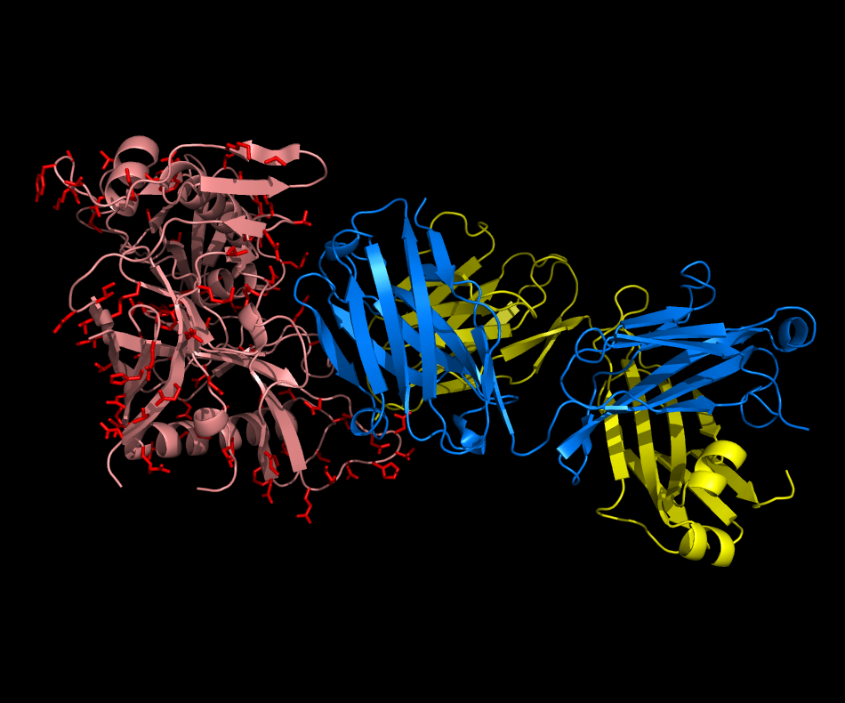

# vHIV
An HIV vaccine (preliminary)

  

  vHIV (salmon and red) shown bound to N6 heavy and light chains (blue and yellow)

  Potential glycosylation sites selected by gly21 software on the gp120 monomer are shown in red.

  (based on 5TE4.PDB -- DOI:10.1016/j.immuni.2016.10.027)

After seeing the zHIV neutralizer on my computer screen for the first time, one of the first questions that came to mind was whether or not it would be possible to make more molecules like that one. The neutralizer was derived from the N6 antibody, which aside from the fact that it can neutralize some 98% of all HIV isolates it was tested against, has the interesting property that the light chain had evolved in such a way that it essentially stayed out of the way with the majority of the binding interaction being between the heavy chain and HIV's gp120 protein. This feature of N6 was used to make the small molecule HIV neutralizer zHIV. So in essence the question is whether or not it is possible to trick the immune system into making antibodies that bind mostly with one chain or the other such that making small molecule theraputics from the antibodies would be facilitated. Another way to ask this question is to ask whether or not it is possible to create a vaccine that elicits antibodies with single chain binding properties.

Since I already had a crystal structure of N6 bound to gp120 on my computer for the zHIV design, making a vaccine that might recreate something along the lines of N6 seems like a good place to start. For the zHIV design I had left gp120 alone and had gly21 software pick glycosylation sites on an N6 fragment. So what if I left N6 alone and had gly21 pick glycosylation sites on gp120? In other words, to make a neutralizer, glycosylate one of the molecules, to make a vaccine, glycosylate the other. Wouldn't it be great if we tried the vaccine and the immune system automatically generated broadly neutralizing single chain binding antibodies like N6? So I went ahead and did the design. Like with zHIV one would need to select glycosylation sites from among those suggested by gly21 experimentally. Look for mutants that express efficiently and are glycosylated efficiently. One might like to pay attention to glycosylation sites that are already there. And one might like to use a more complete crystal structure of gp120. The one in 5TE4.PDB appears to be incomplete.

Interestingly, work has been proceeding along these lines using gp120's built in glycosylation sites and selective deglycosylation in the vicinity of the CD4 binding site (DOI:10.1016/j.celrep.2017.04.013). Needless to say, there's more to the picture than meets the eye. Gp120 trimers that are completely glycosylated show very little immunogenicity. It was necessary to remove glycans in the vicinity of the CD4 binding site for the trimers to be immunogenic. The nature of the antibody binding in the selective deglycosylation experiments were not sufficiently characterized to determine if any were single chain binders, although there were some indications of neutralization broadness. So I think this idea of "focused immunogenicity" deserves further exploration. This might include glycoengineering not only of the location of the glycans but expression system engineering to better control glycan composition.

